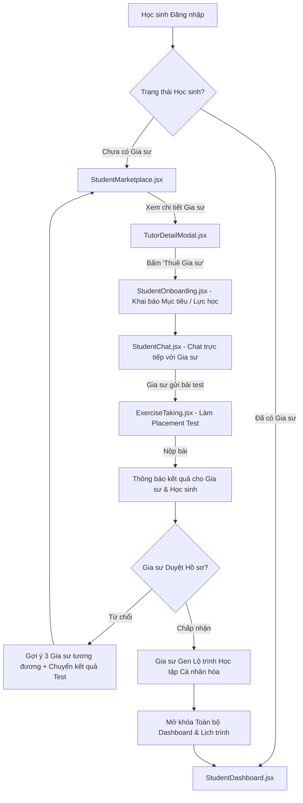

# Executive Brief & Technical Requirement Document (TRD)
## Next-Gen EdTech Matching & Adaptive Learning System

---

## 1. Executive Summary & Vision

Platform hiện tại đã hoàn thiện bộ khung giao diện cơ bản dành cho Học sinh dựa trên stack **React + Vite + TailwindCSS + Lucide Icons** với 6 màn hình lõi:
- `StudentDashboard.jsx` (Tổng quan chỉ số)
- `StudentSchedule.jsx` (Lịch trình học tập)
- `StudentExercises.jsx` (Danh sách bài tập)
- `ExerciseTaking.jsx` (Giao diện làm bài)
- `StudentProgress.jsx` (Theo dõi tiến bộ 6 kỹ năng)
- `StudentMaterials.jsx` (Bài giảng & Tài liệu)

Tài liệu này định hướng nâng cấp hệ thống từ mô hình **Quản lý học tập thụ động (Passive LMS)** sang **Hệ thống Ghép đôi & Lộ trình Cá nhân hóa Adaptive (Active Tutor Matching & AI-Driven Learning Flow)**. Luồng mới bổ sung 4 giai đoạn chiến lược trước khi học sinh bước vào khóa học chính thức:

```
[ Giai đoạn 1: Khám phá ] -> [ Giai đoạn 2: Hồ sơ & Chat ] -> [ Giai đoạn 3: Test Đầu vào ] -> [ Giai đoạn 4: Gen Lộ trình ]
     Marketplace & Filter         Profile Onboarding & Chat        Placement Quiz (Dynamic)        Adaptive Learning Path
```

---

## 2. Luồng Trải nghiệm Người dùng Chi tiết (User Journey Flow)



### Chi tiết các bước tương tác (Step-by-Step Breakdown)

1. **Bước 1: Chào mừng & Khám phá Gia sư (Marketplace)**
   - Hệ thống kiểm tra trạng thái account (`studentStatus`). Nếu chưa ghép đôi, điều hướng trực tiếp vào `StudentMarketplace.jsx`.
   - Hiển thị banner chào mừng + danh sách thẻ gia sư với bộ lọc đa chiều (Môn học, Lớp, Mức giá, Khung giờ rảnh, Đánh giá sao).
   - Minh bạch trạng thái lịch dạy: Badge `FULL` (Không thể đặt) hoặc `RẢNH X BUỔI/TUẦN` (Sẵn sàng kết nối).

2. **Bước 2: Khai báo Hồ sơ Đầu vào & Nhắn tin (Onboarding & Chat)**
   - Học sinh chọn Gia sư $
ightarrow$ Nhấn "Kết nối".
   - Popup `StudentOnboarding.jsx` xuất hiện yêu cầu khai báo nhanh:
     - Mục tiêu học tập (VD: Luyện thi IELTS 6.5, Củng cố Toán 12).
     - Học lực tự đánh giá & Khung giờ rảnh.
   - Hệ thống tự động tạo phòng chat `StudentChat.jsx` và đính kèm Hồ sơ năng lực vừa tạo vào tin nhắn đầu tiên.

3. **Bước 3: Bài Đánh giá Năng lực Đầu vào (Placement Assessment)**
   - Trong `StudentChat.jsx`, Gia sư bấm nút "Gửi bài Test đánh giá năng lực" (chọn đề từ ngân hàng câu hỏi hoặc gợi ý AI dựa trên hồ sơ học sinh).
   - Học sinh nhận tin nhắn chứa Card "Bài Quiz Đánh giá Đầu vào (15-20 phút)".
   - Bấm "Làm bài" $
ightarrow$ Chuyển sang `ExerciseTaking.jsx` (đã bật cờ `isPlacementTest={true}`).
   - Học sinh hoàn thành $
ightarrow$ Hệ thống tự động chấm điểm trắc nghiệm & gửi báo cáo phân tích kĩ năng sơ bộ cho cả 2 bên.

4. **Bước 4: Quyết định, Tạo Lộ trình & Mở khóa Hệ thống (Approval & Path Generation)**
   - Gia sư đánh giá kết quả Quiz + cuộc hội thoại Chat:
     - **Trường hợp Từ chối:** Gia sư chọn lý do. Hệ thống kích hoạt *Fallback Mechanism*: Gợi ý 3 gia sư có trình độ tương đương và tự động chuyển toàn bộ kết quả Quiz đã làm sang Gia sư mới để học sinh không cần làm lại.
     - **Trường hợp Chấp nhận:** Gia sư nhấn nút **"Generate Lộ trình Cá nhân hóa"**. Hệ thống tự động phân bổ bài học/buổi học vào `StudentSchedule.jsx`, tạo biểu đồ điểm xuất phát trên `StudentProgress.jsx`, và mở khóa đầy đủ Sidebar LMS.

---

## 3. Kiến trúc Cấu trúc Màn hình & Router (React/Vite)

### Danh sách Màn hình & Thành phần (Components & Pages)

```text
src/
├── components/
│   ├── layout/
│   │   ├── Sidebar.jsx              # Render dynamic theo studentStatus (Full vs Restricted)
│   │   └── Header.jsx               # Hiển thị Thông báo, Status Badge, Profile
│   └── cards/
│       ├── TutorCard.jsx            # Card gia sư (Avatar, Badge lịch, Rating, Stats)
│       └── QuizMessageCard.jsx      # Card bài Quiz nằm trong khung Chat
├── pages/
│   ├── student/
│   │   ├── StudentMarketplace.jsx   # [MỚI] Tìm kiếm, lọc & danh sách Gia sư
│   │   ├── TutorDetailModal.jsx     # [MỚI] Modal chi tiết hồ sơ & đánh giá
│   │   ├── StudentOnboarding.jsx    # [MỚI] Khai báo thông tin / mục tiêu học tập
│   │   ├── StudentChat.jsx          # [MỚI] Nhắn tin Gia sư <-> Học sinh
│   │   ├── StudentDashboard.jsx     # Tổng quan chỉ số (Dành cho học sinh đã ghép đôi)
│   │   ├── StudentSchedule.jsx      # Lịch trình học tập theo tuần/giai đoạn
│   │   ├── StudentExercises.jsx     # Danh sách bài tập được giao
│   │   ├── ExerciseTaking.jsx       # Giao diện làm bài (BTVN + Placement Test)
│   │   ├── StudentProgress.jsx      # Biểu đồ tiến bộ 6 kỹ năng
│   │   └── StudentMaterials.jsx     # Video bài giảng & Tài liệu
```

---

## 4. Thiết kế Quản lý Trạng thái Người dùng (State Management)

Hệ thống sử dụng State toàn cục (`StudentContext` hoặc `Redux/Zustand`) để điều phối giao diện dựa trên biến `studentStatus`:

| Trạng thái (`studentStatus`) | Mô tả | Màn hình mặc định | Sidebar / Menu |
| :--- | :--- | :--- | :--- |
| `SEARCHING` | Chưa tìm/chọn Gia sư | `StudentMarketplace.jsx` | Khóa các mục Schedule, Exercises, Progress, Materials |
| `ONBOARDING` | Đang điền hồ sơ năng lực | `StudentOnboarding.jsx` | Khóa các mục LMS |
| `CHAT_&_QUIZ` | Đang trao đổi & Làm bài test | `StudentChat.jsx` / `ExerciseTaking.jsx` | Hiển thị duy nhất mục "Hộp thư & Đánh giá" |
| `WAITING_APPROVAL` | Đã nộp test, chờ Gia sư duyệt | `StudentChat.jsx` (Trạng thái chờ) | Hiển thị thông báo "Đang chờ Gia sư duyệt" |
| `MATCHED` | Gia sư đã nhận & Gen lộ trình | `StudentDashboard.jsx` | **Mở khóa 100% tính năng LMS** |

---

## 5. Đề xuất UI/UX Enhancements Chi tiết

1. **Thẻ Gia sư (TutorCard UI):**
   - **Visual Badges:** Muted green `#10B981` cho "Rảnh lịch T2-T4-T6", Soft red/gray `#EF4444` cho "Hết chỗ (FULL)".
   - **Metrics Bar:** Đánh giá Sao (`4.9 ★`), Số giờ đã dạy (`350+ giờ`), Tỉ lệ học sinh tiến bộ (`95%`).
   - **Social Proof:** Thêm section "Đánh giá từ học sinh cũ" dạng slider trong `TutorDetailModal.jsx`.

2. **Khung Chat Tích hợp (StudentChat UI):**
   - Không chỉ nhắn tin văn bản, tích hợp **Rich Interactive Cards**:
     - *Card 1:* Hồ sơ mục tiêu của Học sinh.
     - *Card 2:* Đề xuất Bài Quiz Đánh giá năng lực (có đếm ngược thời gian).
     - *Card 3:* Báo cáo kết quả Quiz ngay sau khi làm xong.
     - *Card 4:* Bản preview Lộ trình học tập do Gia sư khởi tạo.

3. **Cải tiến Màn hình Tiến độ (`StudentProgress.jsx`):**
   - Thêm mốc **"Điểm khởi điểm (Baseline)"** được ghi nhận từ Bài Quiz đầu vào.
   - Biểu đồ Ra-da (Radar Chart) hoặc Biểu đồ Đường (Line Chart) so sánh giữa *Năng lực ban đầu* vs *Năng lực hiện tại* qua từng tuần học.

---

## 6. Lộ trình Triển khai Code (Implementation Roadmap for Antigravity)

- [ ] **Sprint 1: Core Flow Setup**
  - Khai báo State Manager quản lý `studentStatus`.
  - Xây dựng UI `StudentMarketplace.jsx` và `TutorCard.jsx` với mock data danh sách gia sư.
  - Xây dựng Modal `StudentOnboarding.jsx` thu thập thông tin học sinh.

- [ ] **Sprint 2: Interactive Chat & Quiz Integration**
  - Xây dựng UI `StudentChat.jsx` hỗ trợ hiển thị tin nhắn hệ thống + Card bài Test.
  - Cập nhật `ExerciseTaking.jsx`: Thêm mode `isPlacementTest` (ẩn lời giải, tự động gửi kết quả về Chat).

- [ ] **Sprint 3: Roadmap Generation & LMS Unlocking**
  - Xây dựng Component mô phỏng Gia sư duyệt & Gen lộ trình.
  - Kết nối dữ liệu lộ trình vào `StudentSchedule.jsx` và thiết lập mốc Baseline cho `StudentProgress.jsx`.
  - Test toàn bộ luồng End-to-End từ `SEARCHING` $
ightarrow$ `MATCHED`.
