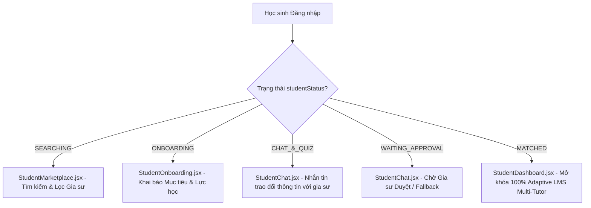

# Phạm vi chức năng — Vai trò Học sinh

> Tài liệu con chi tiết hóa mục 4.3 trong `docs/problem-statement.md`. Dùng làm tài liệu tham chiếu khi thiết kế, triển khai và kiểm thử các tính năng cho vai trò **Học sinh (Student)** trên cả hai mô hình: **Hệ thống Ghép đôi Gia sư (Next-Gen Matching)** và **Hệ thống Quản lý Học tập Cá nhân hóa Adaptive (Multi-Tutor LMS)**.

## 1. Tổng quan vai trò

Học sinh là trung tâm của trải nghiệm học tập trên nền tảng. Vai trò này trải dài qua 5 giai đoạn chiến lược từ khâu tìm kiếm gia sư phù hợp đến học tập tương tác chủ động cùng nhiều gia sư (Multi-Tutor) theo lộ trình được thiết kế riêng.

**Nguyên tắc cốt lõi:**
- **Mô hình Ghép đôi & Multi-Tutor:** Học sinh có thể tìm kiếm, kết nối và học cùng **nhiều Gia sư** chuyên môn cùng lúc (VD: IELTS Speaking với *Cô Lan Anh*, IELTS Writing với *Thầy Minh Quân*, Phát âm IPA với *Cô Thu Hà*).
- **Trải nghiệm Học tập Adaptive:** Lộ trình bài học, bài tập và báo cáo tiến bộ tự động thích ứng dựa trên mốc năng lực khởi điểm (**Baseline Placement Test**) và sự tăng trưởng theo từng tuần.
- **Hệ thống Rich Interactive Cards:** Khung Chat tương tác trực tiếp qua các thẻ thông minh (Hồ sơ mục tiêu, Đề xuất Quiz, Báo cáo kết quả, Preview Lộ trình, Fallback Gia sư thay thế).
- **Giao diện Dynamic & State Management:** Sidebar và TopBar tự động mở khóa/giới hạn quyền truy cập dựa trên trạng thái `studentStatus`.

## 2. Mô hình quyền & phạm vi dữ liệu

| Hạng mục | Mô tả |
|---|---|
| Phạm vi Gia sư | Học sinh chỉ kết nối và xem lộ trình học của các Gia sư đã match hoặc đang tương tác |
| Phạm vi Dữ liệu LMS | Bài tập, lịch học, báo cáo tiến độ và tài liệu thuộc về tài khoản cá nhân |
| Quyền thực hiện | Tìm kiếm gia sư, điền form onboarding, làm placement test/bài tập, đổi lịch học, tải tài liệu |
| Quyền xem | Báo cáo tiến bộ 6 kỹ năng, baseline placement test, video bài giảng, lịch sử điểm số |
| Không có quyền | Quản lý học sinh khác, tạo/sửa đề thi gốc, duyệt hồ sơ gia sư, xử lý thanh toán thực |

> **Mô hình dữ liệu (hệ quả của mô hình Multi-Tutor LMS):** mỗi học sinh có thể kết nối với nhiều gia sư chuyên môn. Dữ liệu bài tập, lịch học, báo cáo tiến bộ và tài liệu được phân loại và quản lý theo từng gia sư hoặc tổng hợp chung toàn bộ các gia sư phụ trách.

## 3. Phạm vi chức năng chi tiết

### 3.1. Khám phá & Tìm kiếm Gia sư (Marketplace)

| Mã | Chức năng | Mô tả | Trạng thái prototype |
|---|---|---|---|
| HS-MP-01 | Giao diện Hero Marketplace | Banner chào mừng, thanh tìm kiếm từ khóa và bộ lọc đa tiêu chí (Môn học/Kỹ năng, Cấp học, Mức giá, Khung giờ rảnh) | ✅ `StudentMarketplace.jsx` |
| HS-MP-02 | Thẻ thông tin Gia sư (TutorCard) | Hiển thị điểm rating (4.9★), số giờ dạy, học phí, hình thức (Online/Offline), trường ĐH, giải thưởng nổi bật & Badge trạng thái lịch | ✅ `TutorCard.jsx` |
| HS-MP-03 | Modal Hồ sơ Chi tiết (TutorDetailModal) | Xem bằng cấp/chứng chỉ, lý lịch học tập (năm sinh, quê quán, nơi ở, trường Cấp 3, điểm thi THPT/ĐH, GPA), huy hiệu giải thưởng khen thưởng & nhận xét học sinh cũ | ✅ `TutorDetailModal.jsx` |
| HS-MP-04 | Nút Kết nối / Thuê Gia sư | Bấm "Kết nối với Gia sư" để chuyển sang bước điền hồ sơ mục tiêu đầu vào | ✅ `StudentMarketplace.jsx` |

### 3.2. Khai báo Hồ sơ Mục tiêu (Profile Onboarding)

| Mã | Chức năng | Mô tả | Trạng thái prototype |
|---|---|---|---|
| HS-OB-01 | Form Khai báo 3 Bước | Thu thập thông tin: Mục tiêu học tập (IELTS 6.5, Giao tiếp...), Trình độ tự đánh giá (A1-C2), Kỹ năng yếu cần ưu tiên và Khung giờ rảnh mong muốn | ✅ `StudentOnboarding.jsx` |
| HS-OB-02 | Tự động Tạo Phòng Chat | Sau khi gửi hồ sơ, hệ thống tự động khởi tạo phòng chat với Gia sư được chọn và gửi đính kèm Hồ sơ mục tiêu vào tin nhắn đầu tiên | ✅ `StudentOnboarding.jsx` |

### 3.3. Hộp thư Đa Gia sư & Interactive Chat Cards

| Mã | Chức năng | Mô tả | Trạng thái prototype |
|---|---|---|---|
| HS-CT-01 | Khung Chat 2 Cột | Cột trái liệt kê danh sách Gia sư đã kết nối kèm Badge trạng thái (`Đã Match`, `Chờ duyệt`, `Làm Test`). Cột phải là khung nhắn tin chi tiết | ✅ `StudentChat.jsx` |
| HS-CT-02 | Rich Card: Hồ sơ Mục tiêu | Thẻ hiển thị thông tin mục tiêu học sinh đã khai báo ở bước Onboarding | ✅ `StudentChat.jsx` |
| HS-CT-03 | Rich Card: Đề xuất Quiz Test | Thẻ đề xuất bài Placement Test kèm thời lượng đếm ngược (15-20 phút) và nút "Bắt đầu làm bài ngay" | ✅ `QuizMessageCard.jsx` |
| HS-CT-04 | Rich Card: Báo cáo Kết quả Test | Thẻ báo cáo điểm số, phân tích 6 kỹ năng và lời nhắn nhận xét từ Gia sư ngay sau khi nộp bài | ✅ `QuizMessageCard.jsx` |
| HS-CT-05 | Rich Card: Preview Lộ trình | Thẻ xem trước bản thảo Lộ trình cá nhân hóa do Gia sư khởi tạo kèm nút "Chấp nhận kích hoạt LMS" | ✅ `StudentChat.jsx` |
| HS-CT-06 | Rich Card: Fallback Từ chối | Trường hợp Gia sư từ chối, thẻ tự động gợi ý 3 Gia sư tương đương và chuyển kết quả Test đã làm sang Gia sư mới | ✅ `StudentChat.jsx` |

### 3.4. Bài Đánh giá Năng lực Đầu vào - Placement Assessment (Optional)

| Mã | Chức năng | Mô tả | Trạng thái prototype |
|---|---|---|---|
| HS-EX-01 | Chế độ Placement Test | Bật cờ `isPlacementTest={true}`, ẩn đáp án/lời giải chi tiết trong quá trình làm bài | ✅ `ExerciseTaking.jsx` |
| HS-EX-02 | Đồng hồ đếm ngược 15:00 | Đếm ngược thời gian làm bài thực tế, tự động nộp bài khi hết giờ | ✅ `ExerciseTaking.jsx` |
| HS-EX-03 | Tự động Chấm & Gửi Kết quả | Chấm điểm trắc nghiệm tự động, gửi báo cáo phân tích về phòng Chat với Gia sư tương ứng | ✅ `ExerciseTaking.jsx` & `StudentChat.jsx` |

### 3.5. Tổng quan LMS Multi-Tutor (Student Dashboard)

| Mã | Chức năng | Mô tả | Trạng thái prototype |
|---|---|---|---|
| HS-DB-01 | Active Tutors Bar | Thanh hiển thị các Gia sư cá nhân đang ghép đôi kèm Avatar, môn học đảm nhận, tiến độ % và nút nhấp nhanh "Nhắn tin" / "Phòng học" | ✅ `StudentDashboard.jsx` |
| HS-DB-02 | Bộ lọc Đa Gia sư | Lọc thông tin tổng quan, lịch học và bài tập theo từng Gia sư hoặc xem tất cả | ✅ `StudentDashboard.jsx` |
| HS-DB-03 | Cảnh báo Kỹ năng yếu | Alert thông minh nhắc nhở kỹ năng cần ưu tiên cải thiện kèm bài tập bổ trợ do Gia sư giao | ✅ `StudentDashboard.jsx` |
| HS-DB-04 | Tiến độ Thích ứng Multi-Tutor | Khối so sánh mốc khởi điểm Baseline vs Tăng trưởng thực tế theo từng Gia sư chuyên môn | ✅ `StudentDashboard.jsx` |

### 3.6. Lịch học & Phòng học Trực tuyến (Student Schedule)

| Mã | Chức năng | Mô tả | Trạng thái prototype |
|---|---|---|---|
| HS-SC-01 | Đa chế độ xem Lịch | Hỗ trợ xem **`🗓️ Weekly Calendar Grid`** (Lưới 7 ngày chuẩn Google Calendar) và **`📋 Agenda Stream`** (Nhật ký từng buổi) | ✅ `StudentSchedule.jsx` |
| HS-SC-02 | Color-Coding & Bộ lọc Gia sư | Mã màu thương hiệu riêng cho từng Gia sư (Violet, Blue, Emerald) kèm bộ lọc xem theo từng Gia sư | ✅ `StudentSchedule.jsx` |
| HS-SC-03 | Smart Session Cards | Thẻ buổi học hiển thị 4 trạng thái: `🔴 LIVE` (Phòng Jitsi/Zoom), `🟢 Completed` (Replay & Slide), `🔵 Upcoming`, `🟡 Rescheduled` | ✅ `StudentSchedule.jsx` |
| HS-SC-04 | Modal Xin nghỉ / Đổi lịch | Popup cho phép chọn lý do, đề xuất 2-3 khung giờ rảnh mới và gửi yêu cầu tới Chat với Gia sư | ✅ `StudentSchedule.jsx` |
| HS-SC-05 | Đồng bộ Google/Apple Calendar | Nút sao chép đường dẫn `.ics` / iCal một chạm để đồng bộ lịch học về điện thoại hoặc máy tính | ✅ `StudentSchedule.jsx` |
| HS-SC-06 | Nhật ký & Đánh giá Sau buổi học | Modal xem lại tóm tắt kiến thức, từ vựng, slide PDF, đánh giá 3 tiêu chí từ Gia sư, gửi feedback 2 chiều (rating 1-5★ & tags) và bài test cuối buổi | ✅ `SessionDetailModal.jsx` & `StudentSchedule.jsx` |

### 3.7. Bài tập & Kiểm tra Thích ứng (Student Exercises)

| Mã | Chức năng | Mô tả | Trạng thái prototype |
|---|---|---|---|
| HS-EX-04 | Bộ lọc Bài tập Multi-Tutor | Lọc bài tập theo Gia sư phân công và Trạng thái (`Chưa làm`, `Chờ chấm`, `Đã chấm`) | ✅ `StudentExercises.jsx` |
| HS-EX-05 | Thẻ Bài tập Rich Cards | Hiển thị Gia sư giao bài, nhãn kỹ năng, độ khó, hạn nộp và điểm số | ✅ `StudentExercises.jsx` |
| HS-EX-06 | Tutor Feedback Preview Box | Khối hiển thị lời nhắn & nhận xét chi tiết từ Gia sư đối với bài tập đã được chấm | ✅ `StudentExercises.jsx` |
| HS-EX-07 | Giao diện Làm bài tập | Làm bài trắc nghiệm / tự luận / ghi âm bài nói | ✅ `ExerciseTaking.jsx` |

### 3.8. Báo cáo Tiến bộ & Baseline Adaptive (Student Progress)

| Mã | Chức năng | Mô tả | Trạng thái prototype |
|---|---|---|---|
| HS-PR-01 | Mốc khởi điểm Baseline Assessment | Thẻ ghi nhận kết quả bài khảo sát đầu vào (Baseline score) + Lời nhắn nhận xét ban đầu của Gia sư | ✅ `StudentProgress.jsx` |
| HS-PR-02 | Tabs Tiến độ theo từng Gia sư | Chuyển đổi tab xem chi tiết điểm khởi điểm, điểm hiện tại, điểm mục tiêu và % tăng trưởng theo từng Gia sư | ✅ `StudentProgress.jsx` |
| HS-PR-03 | Biểu đồ Tăng trưởng Kỹ năng | Biểu đồ đường (ProgressChart) thể hiện sự bứt phá 6 kỹ năng từ Tuần 1 đến Tuần 5 | ✅ `StudentProgress.jsx` & `ProgressChart.jsx` |
| HS-PR-04 | Lịch sử Bài kiểm tra đã chấm | Bảng danh sách bài tập/kiểm tra đã chấm điểm kèm nhãn Gia sư chấm bài | ✅ `StudentProgress.jsx` |

### 3.9. Kho Bài giảng Video & Tài liệu (Student Materials)

| Mã | Chức năng | Mô tả | Trạng thái prototype |
|---|---|---|---|
| HS-MT-01 | Bộ lọc Tài liệu Multi-Tutor | Lọc tài liệu theo Gia sư đính kèm và Loại tài liệu (`Video HD` vs `File PDF/Slide`) | ✅ `StudentMaterials.jsx` |
| HS-MT-02 | Modal Xem trước Video Bài giảng | Popup tích hợp Video Player preview xem bài giảng trực tiếp trong ứng dụng | ✅ `StudentMaterials.jsx` |
| HS-MT-03 | Tải file PDF & Slide | Tải file tài liệu học tập kèm thông báo Toast xác nhận | ✅ `StudentMaterials.jsx` |

### 3.10. Điều hướng Động & Thanh Chuyển trạng thái Demo

| Mã | Chức năng | Mô tả | Trạng thái prototype |
|---|---|---|---|
| HS-NAV-01 | Demo Status Bar (TopBar) | Thanh chuyển trạng thái Demo trên TopBar hỗ trợ test nhanh các giai đoạn (`SEARCHING` ➔ `ONBOARDING` ➔ `CHAT_&_QUIZ` ➔ `WAITING_APPROVAL` ➔ `MATCHED`) | ✅ `TopBar.jsx` & `StudentMatchingContext.jsx` |
| HS-NAV-02 | Dynamic Sidebar Menu | Sidebar tự động khóa/mở khóa linh hoạt các mục LMS dựa trên trạng thái ghép đôi của học sinh | ✅ `Sidebar.jsx` & `AppShell.jsx` |

## 4. Tổng hợp trạng thái prototype

| Nhóm chức năng | Đã có màn hình | Chưa có / một phần |
|---|---|---|
| 3.1 Khám phá & tìm kiếm gia sư | ✅ HS-MP-01 → HS-MP-04 (`StudentMarketplace`, `TutorCard`, `TutorDetailModal`) | — |
| 3.2 Khai báo hồ sơ mục tiêu | ✅ HS-OB-01 → HS-OB-02 (`StudentOnboarding`) | — |
| 3.3 Hộp thư Đa gia sư & Chat | ✅ HS-CT-01 → HS-CT-06 (`StudentChat`, `QuizMessageCard`) | — |
| 3.4 Đánh giá năng lực đầu vào | ✅ HS-EX-01 → HS-EX-03 (`ExerciseTaking`) | — |
| 3.5 Tổng quan LMS Multi-Tutor | ✅ HS-DB-01 → HS-DB-04 (`StudentDashboard`) | — |
| 3.6 Lịch học & phòng trực tuyến | ✅ HS-SC-01 → HS-SC-06 (`StudentSchedule`, `SessionDetailModal`) | — |
| 3.7 Bài tập & kiểm tra thích ứng | ✅ HS-EX-04 → HS-EX-07 (`StudentExercises`, `ExerciseTaking`) | — |
| 3.8 Báo cáo tiến bộ Baseline | ✅ HS-PR-01 → HS-PR-04 (`StudentProgress`, `ProgressChart`) | — |
| 3.9 Kho bài giảng & tài liệu | ✅ HS-MT-01 → HS-MT-03 (`StudentMaterials`) | — |
| 3.10 Điều hướng động Demo | ✅ HS-NAV-01 → HS-NAV-02 (`TopBar`, `Sidebar`, `AppShell`) | — |

## 5. Ngoài phạm vi (vai trò Học sinh)

- **Học nhóm tập trung nhiều học sinh:** Giai đoạn này hệ thống thiết kế tối ưu cho mô hình học kèm **1-1** (hoặc học sinh ghép đôi với nhiều Gia sư 1-1 riêng biệt). Dạy nhóm lớn nằm ngoài phạm vi.
- **Xử lý thanh toán thực qua cổng Ngân hàng/VNPAY:** Hệ thống chỉ quản lý trạng thái học phí & lịch học, không tích hợp cổng thanh toán trực tuyến.
- **Hệ thống Server Stream Video riêng:** Các video bài giảng trong prototype sử dụng nhúng dạng Video Player Preview (iframe / HTML5 mock player).
- **Chỉnh sửa đề thi gốc:** Học sinh không có quyền truy cập ngân hàng câu hỏi hoặc sửa đổi đáp án của bài kiểm tra.

## 6. Ghi chú triển khai & Kiến trúc

- **Quản lý Trạng thái toàn cục (State Management):** Sử dụng `StudentMatchingContext.jsx` để lưu trữ biến `studentStatus` (`SEARCHING`, `ONBOARDING`, `CHAT_&_QUIZ`, `WAITING_APPROVAL`, `MATCHED`), kết quả Placement Test, và danh sách Gia sư đã kết nối.
- **Color-Coding System:** Áp dụng hệ thống mã màu nhận diện thương hiệu cho từng Gia sư (*Indigo* cho IELTS Overall, *Blue* cho IELTS Writing, *Emerald* cho IPA Pronunciation) đồng bộ xuyên suốt từ Dashboard, Chat, Schedule, Exercises đến Progress.
- **Routing & Navigation:** Tích hợp chuyển trang mượt mà qua `react-router-dom` v6 (`Routes`, `Route`, `Navigate`, `NavLink`, `useNavigate`).

